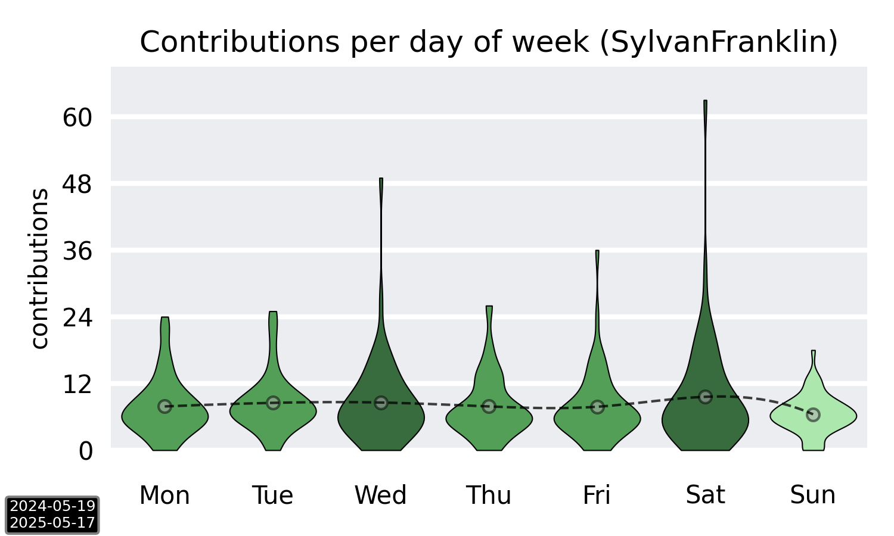

# Commit Graph

_created on: 28-10-2021_

## Description

This project is meant to give you some more insights into your commit behaviour.
It scrapes your GitHub contribution graph and uses Python to create a graph of your commits throughout the weak based on the past year.


## Example


last updated on: _28-10-2021_

## Usage

```bash
# optional
python3 -m venv venv
source venv/bin/activate

pip install -r requirements.txt
python3 main.py <username>
```

## Requirements

`Python 3`, of course.

Packages:
- `requests`
- `beautifulsoup4`
- `matplotlib`
- `pandas`
- `scipy`
